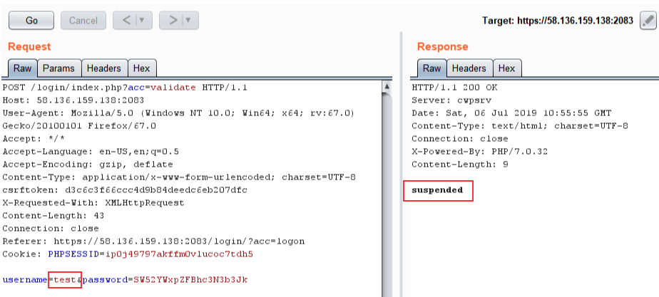
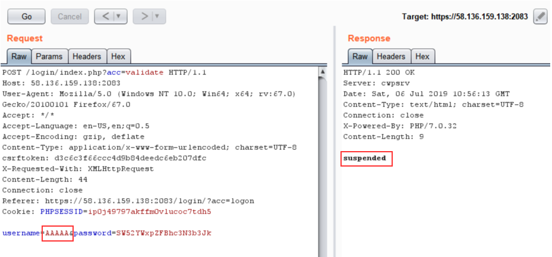
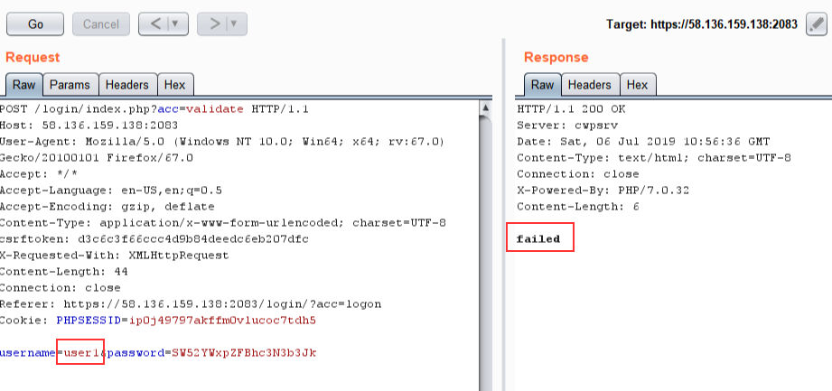
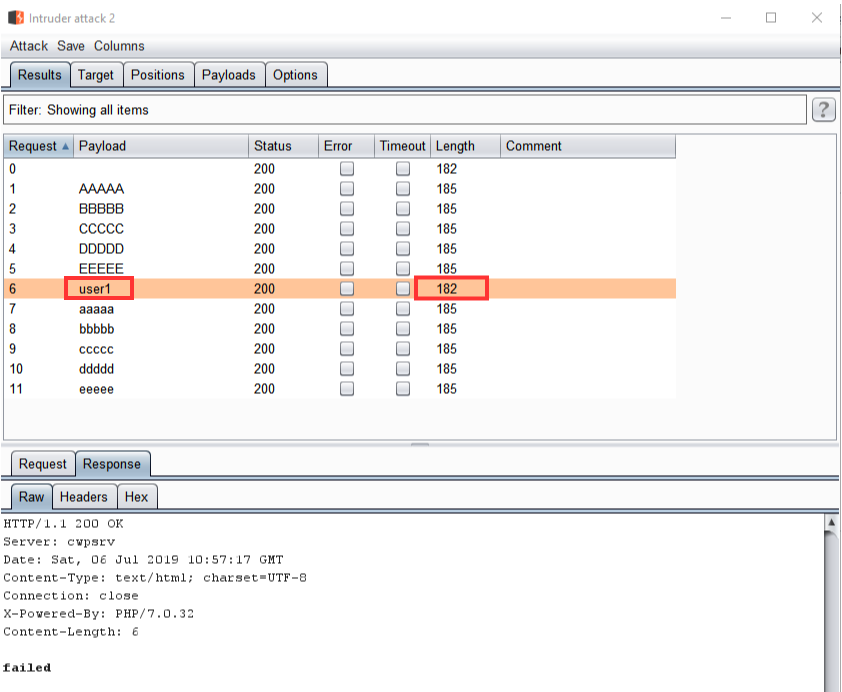

# Information
```
Product     : CWP Control Web Panel
version     : 0.9.8.846
Fixed on    : 0.9.8.xxx
Test on     : CentOS7
Reference   : http://centos-webpanel.com/
CVE-Number  : CVE-2019-13383
```

<br>

# Description

The vulnerability allows remote attacker to check whether a username is valid by reading the HTTP response

<br>

# Reproduce

```
The target server has user "user1"
```

1. Login with invalid username and password

<kbd></kbd>

<br>

2. Intercept the request

<kbd></kbd>

<br>

1. From the request, if the user dose not exist, the server responses "suspended"

<kbd></kbd>

<kbd></kbd>

<br>

4. if the user dose exist, the server responses nothing

<kbd></kbd>

<br>

5. Try brute-forcing username against the server

<kbd></kbd>

<br><br>


# Timeline
```
2019-07-06: Discovered the bug
2019-07-06: Reported to vendor
2019-xx-xx: Vender accepted the vulnerability
2019-xx-xx: The vulnerability has been fixed
2019-xx-xx: Advisory published
```

<br>

# Discovered by
```
Pongtorn Angsuchotmetee, Nissana Sirijirakal, Narin Boonwasanarak
```