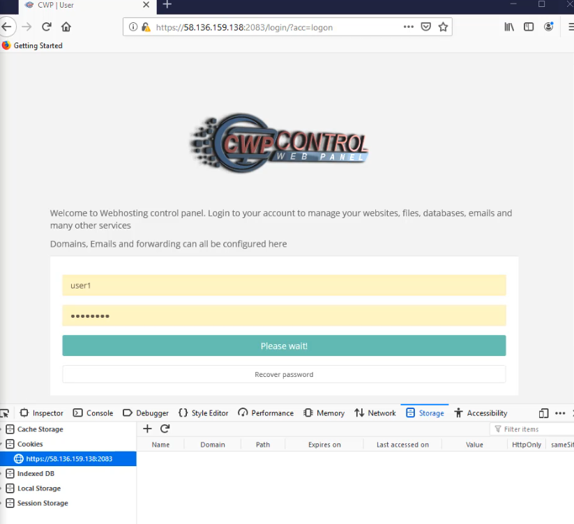
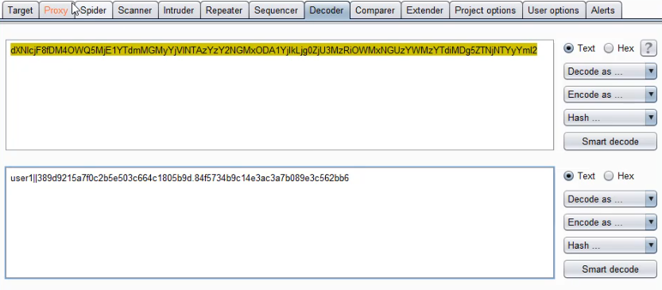
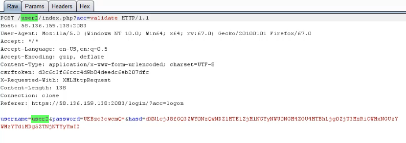

# Information
```
Product             : CWP Control Web Panel
Vulnerability Name  : User panel bypass Login
version             : 0.9.8.838
Fixed on            : 0.9.8.848
Test on             : CentOS 7.6.1810 (Core)
Reference           : http://centos-webpanel.com/
                    : https://control-webpanel.com/changelog
CVE-Number          : CVE-2019-13605
```

<br>

# Description

By leveraging knowledge of a valid username, remoted attackers can bypass login process and become the target user

<br>

# Reproduce

1. Create and login with target username on testing environment

<kbd></kbd>

<br>

2. Save the HTTP response body

<kbd></kbd>
<kbd></kbd>
<br>

<br>

3. The token result from different server with the same username

<kbd></kbd>
<kbd></kbd>

<br>

4. Against the real target, login and intercept the response, replace token value from we have got form our testing environment

<kbd></kbd>

<br>

5. Replace part of target URL and request body with the target username

<kbd></kbd>

<br>

6. Become

<kbd></kbd>

<br>

# Timeline
```
2019-07-07: Discovered the bug
2019-07-07: Reported to vendor
2019-07-07: Vender accepted the vulnerability
2019-07-11: The vulnerability has been fixed
2019-07-15: Advisory published
```

<br>

# Discovered by
```
Pongtorn Angsuchotmetee
```