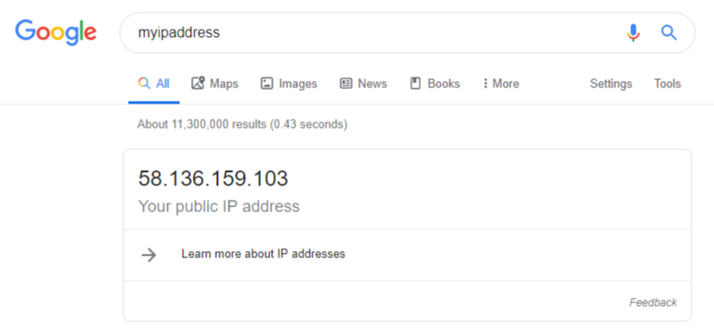
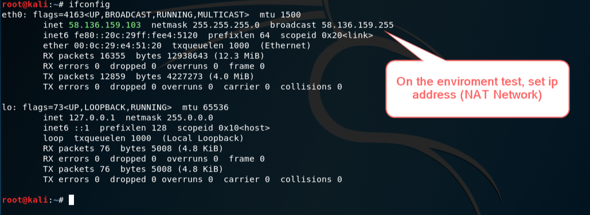
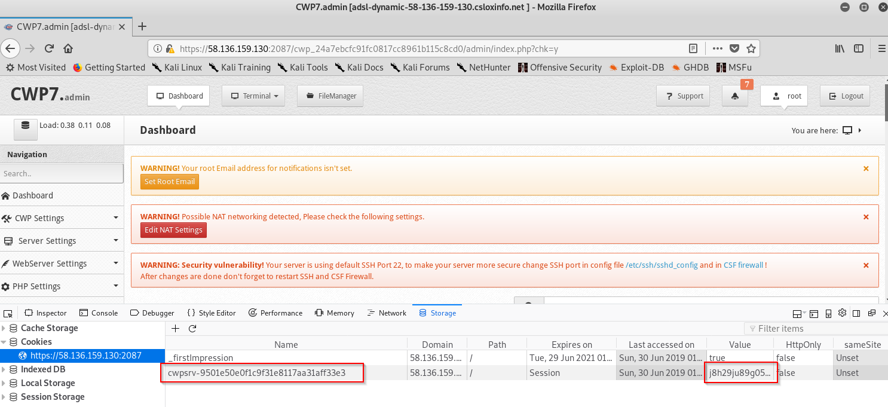
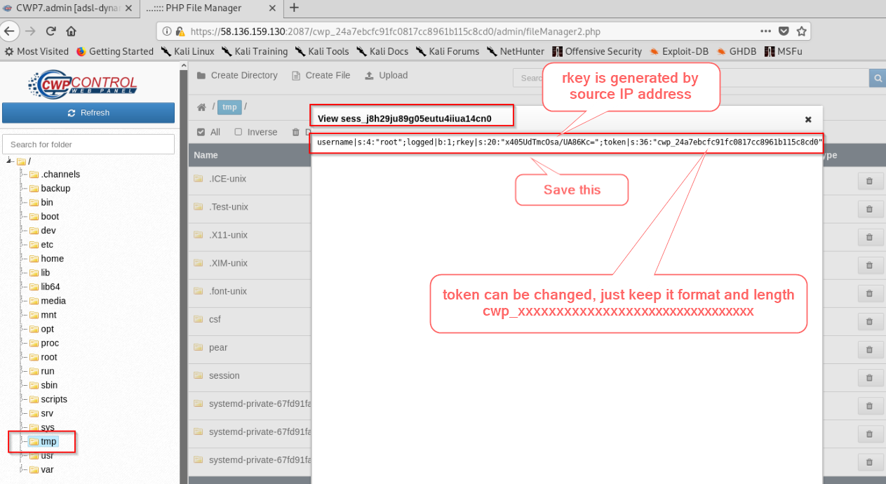
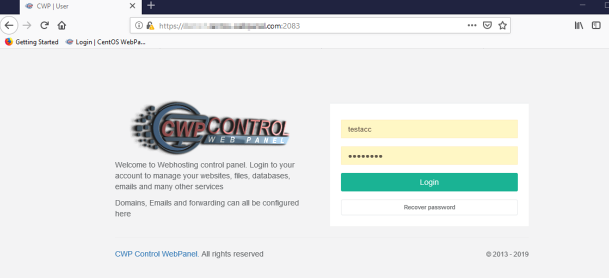
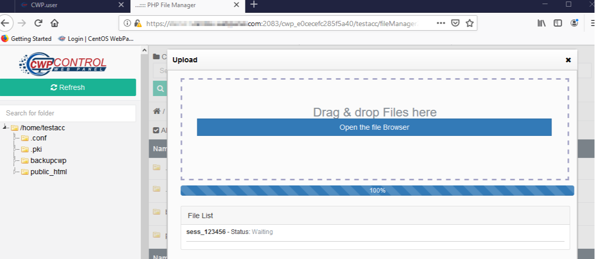
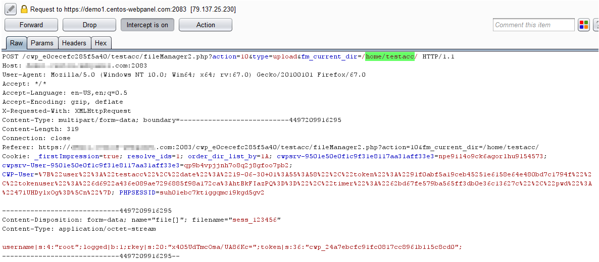
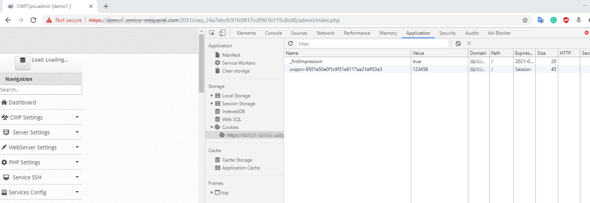
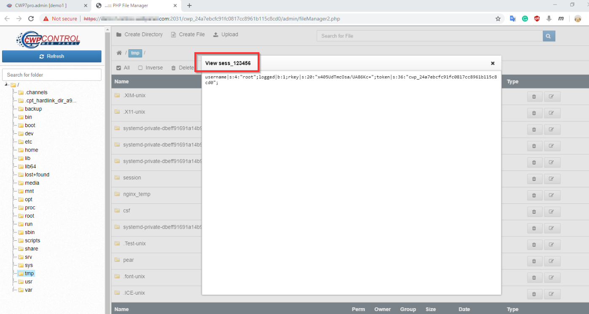
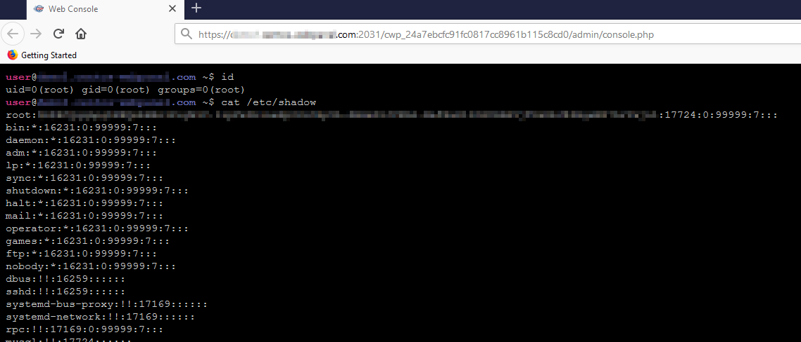

# Information
```
Product     : CWP Control Web Panel
version     : 0.9.8.836
Fixed on    : 0.9.8.846
Test on     : CentOS7
Reference   : http://centos-webpanel.com/
CVE-Number  : CVE-2019-13359
```


# Description

The vulnerability allows low privilege users to escalate themself to become a root user by crafting a session file from testing environment and upload to the target server at /tmp directory

<br>

# State 1 Session prepareation (Testing Environment)
1. Check the current IP address of attacker

<kbd></kbd>

<br>

2. Set the IP address on testing environment network

<kbd></kbd>

<br>

3. Login as root on port 2031/2087 and save the cookie name from web browser (cwsrp-xxxxxxxxxxxxxxxxxxxxx)

<kbd></kbd>

<br>

4. Copy the content of session file (/tmp/sess_xxxxxxxxxxxxxx) to a new file "sess_123456"                  # we need "rkey"

<kbd></kbd>

<br>

"sess_123456"

<kbd></kbd>

<br>

5. Save the token value from the session file (cwp_xxxxxxxxxxxxxxxxxxxxxxxxxxxxxxxx)

``
cwp_24a7ebcfc91fc0817cc8961b115c8cd0
``

<br><br>

# State 2 Attack the target

6. On the real target, login as a normal user on port 2083 and upload file "sess_123456" to /tmp directory

<br>

Login

<kbd></kbd>

<br>

Upload sess_123456 file

<kbd></kbd>

<br>

Intercept the request

<kbd></kbd>

<br>

Modify the parameter "fm_current_dir" value to "/tmp/"

<kbd></kbd>

<br>

Upload successfully

<kbd></kbd>

<br>

7. On another browser, replace the token value in the URL https://[target.com]:2031/cwp_xxxxxxxxxxxxxxxxxxxxxxxxxxxxxxxx/admin/index.php and create cookie name "cwsrp-xxxxxxxxxxxxxxxxxxxxx" and set its value to "123456" (sess_123456)

<kbd></kbd>

<br>

8.  Open the URL and become the root user

<br>

Root panel

<kbd></kbd>

<br>

Check the file sess_123456

<kbd></kbd>

<br>

Web console

<kbd></kbd>

<br>

*From step 6 - 8 need doing it quickly. if we do it too slow, the application will change the permission of file sess_123456 to 600 and the file will become 0 byte. If this happened, attacker need to change session file name and repeat the steps again

<br><br>


# Timeline
```
2019-06-30: Discovered the bug
2019-06-30: Reported to vendor
2019-06-30: Vender accepted the vulnerability
2019-07-02: The vulnerability has been fixed
2019-07-06: Advisory published
```

<br>

# Discovered by
```
Pongtorn Angsuchotmetee, Nissana Sirijirakal, Narin Boonwasanarak
```